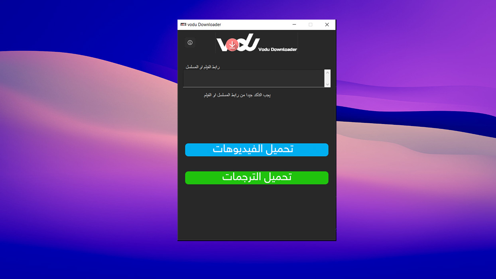
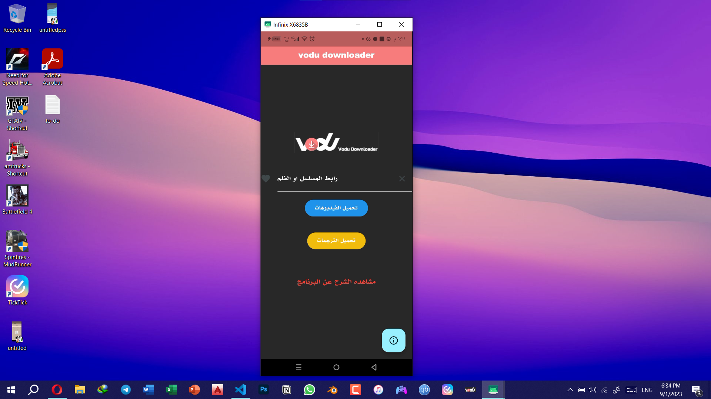

<div id="top"></div>

<p align="center">
  
  <h1 align="center" style="margin: 0 auto 0 auto;">Vodu Downloader</h1>
  <h5 align="center" style="margin: 0 auto 0 auto;"> "Downloader from vodu website"</h5>
  </p>


 ##  Introduction
Welcome to the Video Download Tool!
    This tool allows you to easily download videos, subtitles, apps, and games from vodu.me and share.vodu.store.
    To get started, follow these steps:
    <br>
    1. Enter the URL of the series, video, or app/game page in the provided input field.
    <br>
    2. Click the 'Download Subtitle' button to download subtitle links.
    <br>
    3. Click the 'Download Video' button to download video links.
    <br>
    4. Click the 'Download Apps/Games' button to download applications and games from share.vodu.store.
    <br>
    5. Choose a download path for the files when prompted."
    <br>
    6. Monitor the progress bar for the download status
    <br>
    Enjoy using the Vodu Downloader Tool!


  
# Getting Started  
Below are the Instructions on setting up the project Locally.</br>

## Installation for android

[](https://github.com/sajjad-salam/vodu_downloader_app/raw/main/build/app/outputs/flutter-apk/app-release.apk)
## Installation for windows

[](https://github.com/sajjad-salam/vodu_downloader/raw/main/dist/vodu_downloader.zip)


## Features

|Download videos|         ✔️         |
<br>
|Download translations|   ✔️         |
<br>
|Download resume|         ✔️         |
<br>
|Download in 1080 resolution|   ✔️   |
<br>
|Download applications and games|         ✔️         |
<br>
|Resume interrupted downloads|   ✔️   |
<br>
|Retry on network failures|   ✔️   |
<br>
|Multi-part download support|   ✔️   |
<br>


## Prequisites 
Below are the Things you will need to use the software and How to install them :
- Operating System - Windows
- Python 3.9.x ( 3.9.7 Tested )
- Pip 3 (Usually gets Installed with Python)

if all the above prequisities are Satisfied, you may proceedto the next section.


## Installation for developers 
Follow these instructions to Setup your Own instance of the App :

</br>


### 1 : Clone the Repo 
Find instructions for [cloning/downloading this repo here](https://docs.github.com/en/repositories/creating-and-managing-repositories/cloning-a-repository), then unzip the repository

</br>

### 2 : Cd to the folder

Open terminal/cmd/powershell and change directory/folder to the cloned folder. [Here are the instructions](https://www.howtogeek.com/659411/how-to-change-directories-in-command-prompt-on-windows-10/)

</br>


</br>

### 4 : Install the PIP packages/dependencies
install requirements :

```sh
pip install -r requirements.txt
```

</br>

### 5 : It's done 🎉 | Run the app
Open Root folder with cmd/terminal , now open `main.py` using python 3.
your terminal should look something like this :
```bash
  (name_of_env) Something...\sajjad>python main.py
```
</br>
🎉 You can develop the tool and Keep me updated by pull request  and let's make this tool useful for everyone


## Apps and Games Download Feature

### Overview
The Apps and Games download feature allows you to download multi-part applications and games from share.vodu.store. The tool automatically discovers all download links and downloads them sequentially with progress tracking.

### How to Use
1. **Enter Vodu Store URL**: Paste a URL from share.vodu.store (e.g., `https://share.vodu.store/#/details/214620`)
2. **Click "Download Apps/Games" Button**: The button with bilingual label (تحميل التطبيقات والألعاب)
3. **Select Download Location**: Choose where you want to save the downloaded files
4. **Monitor Progress**: Watch the progress bar showing current part and overall progress

### Features
- **Multi-Part Download**: Automatically discovers and downloads all parts of apps/games
- **Resume Support**: If download is interrupted, it resumes from the last completed part
- **HTTP Range Requests**: Resumes incomplete files from the last byte downloaded
- **Retry Logic**: Automatically retries failed downloads up to 3 times with 5-second delays
- **Progress Tracking**: Real-time progress showing current part (e.g., "Part 2 of 5") and overall percentage
- **Partial Completion**: If some parts fail, you can retry them later
- **Bilingual Error Messages**: Error messages in both English and Arabic
- **Disk Space Check**: Validates available space before starting download

### Supported URL Format
```
https://share.vodu.store/#/details/[ID]
```

Example:
```
https://share.vodu.store/#/details/214620
```

### Download URL Pattern
The tool extracts download URLs matching this pattern:
```
https://share.vodu.store:9999/store-files/[filename]
```

### Resume Functionality
- **Complete Parts**: Skips already downloaded parts that match expected file size
- **Incomplete Parts**: Resumes from the last byte using HTTP Range requests
- **Different Location**: If you select a different download location, downloads all parts from scratch

### Error Handling
The tool handles common error scenarios:
- Network errors with automatic retry (3 attempts)
- Disk full errors with clear warnings
- Permission denied errors
- Invalid URLs
- Missing or broken download links
- File corruption validation

### Completion Summary
After download completes, you'll see:
- Number of files successfully downloaded
- Total size downloaded
- Save location
- List of any failed parts (if applicable)


</br>
  


# صور من داخل الأداة :




# شرح الأداة: 
[](https://www.youtube.com/watch?v=8l5ig2wf3Ow)


## 📝 Contact Me

If you want to contact me, you can
reach me at sajjad.salam.teama@gmail.com


<p align="right">(<a href="#top">back to top</a>)</p>
