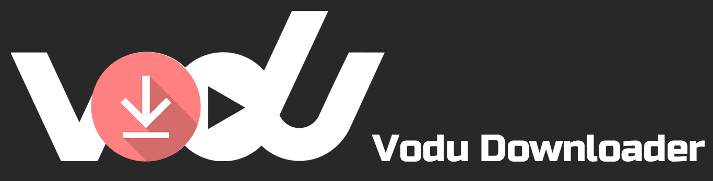
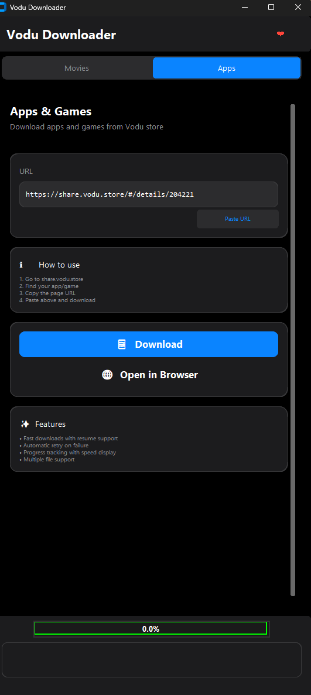
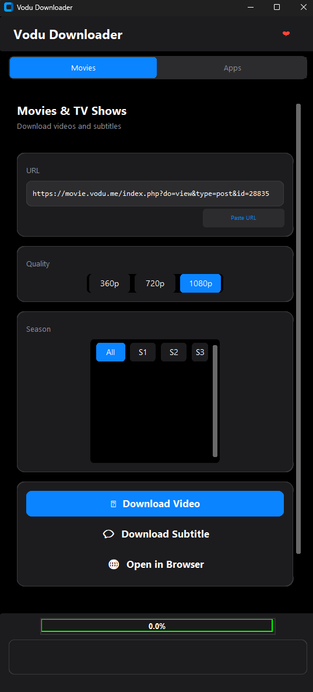

<div id="top"></div>

<p align="center">
  
  <h1 align="center" style="margin: 0 auto 0 auto;">Vodu Downloader</h1>
  <h5 align="center" style="margin: 0 auto 0 auto;"> "Downloader from vodu website"</h5>
  <h6 align="center" style="margin: 10px auto 0 auto; color: #0a84ff;">✨ Now with Modern iOS-Style Dark Theme! ✨</h6>
  </p>

## Introduction
Welcome to the Video Download Tool!
This tool allows you to easily download videos, subtitles, apps, and games from vodu.me and share.vodu.store.
The application now features a **modern iOS-style dark interface** with smooth animations, glassmorphism effects, and excellent UX.

### New iOS-Style Theme Features
- 🎨 **Pure Black Background** - Modern iOS dark mode aesthetic
- 💎 **Glassmorphism Cards** - Semi-transparent elevated surfaces
- 🎯 **Segmented Control Navigation** - Smooth Movies/Apps switching
- 📊 **Gradient Progress Bar** - Color-coded progress (red→orange→green)
- 🔄 **Pill Buttons** - Modern quality and season selectors
- ⚡ **Smooth Animations** - 60fps buttery transitions
- 📱 **Resizable Window** - Flexible layout with minimum size limits

## Screenshots

### Movies & TV Shows Page


### Apps & Games Page


---

## Getting Started

### To get started, follow these steps:
<br>
1. Enter the URL of the series, video, or app/game page in the provided input field.
<br>
2. Select quality (360p, 720p, 1080p) for videos
<br>
3. Select season (All, S1-S10) for TV series
<br>
4. Click the appropriate download button:
   - **Download Video** - Download video files
   - **Download Subtitle** - Download subtitle files
   - **Open in Browser** - Open direct download links in browser
<br>
5. Choose a download path for the files when prompted.
<br>
6. Monitor the progress bar for real-time download status
<br>

Enjoy using the Vodu Downloader Tool!

## Installation for android

[](https://github.com/sajjad-salam/vodu_downloader_app/raw/main/build/app/outputs/flutter-apk/app-release.apk)

## Installation for windows

[](https://github.com/sajjad-salam/vodu_downloader/raw/main/dist/vodu_downloader.zip)

## Features

| Feature | Status |
|---------|--------|
| Download videos | ✔️ |
| Download translations | ✔️ |
| Download resume | ✔️ |
| Download in 1080 resolution | ✔️ |
| Download applications and games | ✔️ |
| Resume interrupted downloads | ✔️ |
| Retry on network failures | ✔️ |
| Multi-part download support | ✔️ |
| Modern iOS-style UI | ✨ NEW |
| Glassmorphism effects | ✨ NEW |
| Smooth animations | ✨ NEW |
| Segmented navigation | ✨ NEW |

## Prerequisites
Below are the Things you will need to use the software and How to install them :
- Operating System - Windows
- Python 3.9+ (3.9+ recommended)
- Pip (Usually gets Installed with Python)

if all the above prerequisites are Satisfied, you may proceed to the next section.

## Installation for developers
Follow these instructions to Setup your Own instance of the App :

### 1 : Clone the Repo
Find instructions for [cloning/downloading this repo here](https://docs.github.com/en/repositories/creating-and-managing-repositories/cloning-a-repository), then unzip the repository

### 2 : Cd to the folder
Open terminal/cmd/powershell and change directory/folder to the cloned folder.

### 3 : Install the PIP packages/dependencies
Install requirements:

```sh
pip install -r requirements.txt
```

### 4 : Run the app 🎉
Open root folder with cmd/terminal, now run `main.py` using python:
```bash
python main.py
```

🎉 You can develop the tool and Keep me updated by pull request and let's make this tool useful for everyone!

## Apps and Games Download Feature

### Overview
The Apps and Games download feature allows you to download multi-part applications and games from share.vodu.store. The tool automatically discovers all download links and downloads them sequentially with progress tracking.

### How to Use
1. **Enter Vodu Store URL**: Paste a URL from share.vodu.store (e.g., `https://share.vodu.store/#/details/214620`)
2. **Switch to Apps Tab**: Click "Apps" in the segmented control
3. **Click "Download" Button**: Start the download process
4. **Select Download Location**: Choose where you want to save the downloaded files
5. **Monitor Progress**: Watch the gradient progress bar showing current part and overall progress

### Features
- **Multi-Part Download**: Automatically discovers and downloads all parts of apps/games
- **Resume Support**: If download is interrupted, it resumes from the last completed part
- **HTTP Range Requests**: Resumes incomplete files from the last byte downloaded
- **Retry Logic**: Automatically retries failed downloads up to 3 times
- **Progress Tracking**: Real-time progress with speed display and ETA
- **Partial Completion**: If some parts fail, you can retry them later

### Supported URL Format
```
https://share.vodu.store/#/details/[ID]
```

Example:
```
https://share.vodu.store/#/details/214620
```

## Tech Stack
- **Python 3.9+** - Core application
- **CustomTkinter** - Modern UI framework
- **Requests** - HTTP client for downloads
- **Selenium** - JavaScript rendering support
- **tqdm** - Progress bars for terminal output

## Project Structure
```
vodu_downloader/
├── main.py                 # Application entry point
├── requirements.txt        # Python dependencies
├── src/
│   └── gui/               # Modern iOS-style GUI
│       ├── app.py         # Main application
│       ├── styles.py      # iOS design tokens
│       ├── widgets.py     # Custom widgets
│       ├── animations.py  # Animation utilities
│       └── pages/         # Page components
│           ├── movies_page.py
│           └── apps_page.py
└── README.md             # This file
```

## صور من داخل الأداة :


# شرح الأداة:
[](https://www.youtube.com/watch?v=8l5ig2wf3Ow)

## 📝 Contact Me

If you want to contact me, you can reach me at sajjad.salam.teama@gmail.com

---

<p align="right">(<a href="#top">back to top</a>)</p>
